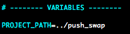

# Push swap checker

Scripts to check various things for the *push_swap* project at [42](https://www.42.fr):
- **checker_tests.sh**: tests different valid and invalid inputs + leaks for the checker program
- **push_swap_tests.sh**: run tests for the push_swap program with different lists of random numbers and calculate the average, minimum and maximum number of instructions (+ leaks)

## Getting started

```
git clone https://github.com/jkgithubrep/42_push_swap_checker.git
```

Change the path to you push_swap project at the top of both scripts.



## Usage

### Checker

The **checker_tests.sh** script will run different tests stored in the *tests.txt* file with the following format:
`test description;expected output;arguments;name of the file with instructions`
Each line corresponds to a specific test. You can select which tests to run by adding their (line) number as argument (see usage below).

Example:
```
non numeric arg;Error$;0 1 2 3 4 123a;list_ok.txt
duplicated values;Error$;0 1 2 3 4 0;list_ok.txt
overflow;Error$;1 234 -12 2147483648 234;list_ok.txt
```

The files with different lists of instructions are stored in the *actions_files* folder:
```
$ cat actions_files/list_ok.txt
sa
sa
ra
pb
pb
pb
ss
sb
pb
rb
rrb
rb
rb
pa
pa
rra
rrr
```

```
Usage: sh checker_tests.sh [tests numbers]
Example:
 sh checker_tests.sh 1 4 5
       > run checker only for tests n°1, n°4 and n°5
```

**_>Output_**:


### Push_swap

The **push_swap_tests.sh** scripts tests the performance of your push_swap program, byrunning a user-defined number of tests, with three parameters: lower bound, upper boudn and number of elements. Several options are also available (see usage below).

```
Usage: ./push_swap_tests.sh [options] nb_of_tests lower_bound upper_bound nb_of_elm
Example:
 sh push_swap_tests.sh -c 150 -200 200 100
      > test checker
      > run 150 different tests with generated lists of 100 random numbers between -200 and 200
Options:
 -h, --help                Display usage
 -a, --all                 Check everything
 -c, --checker             Check checker
 -v, --verbose             Print tests
 -l, --leaks               Check leaks
```

**_>Output_**:


## Issues

If you encounter any issue, you can contact me on slack (jkettani) or by email: jkettani@student.42.fr


## Author

by **jkettani**

